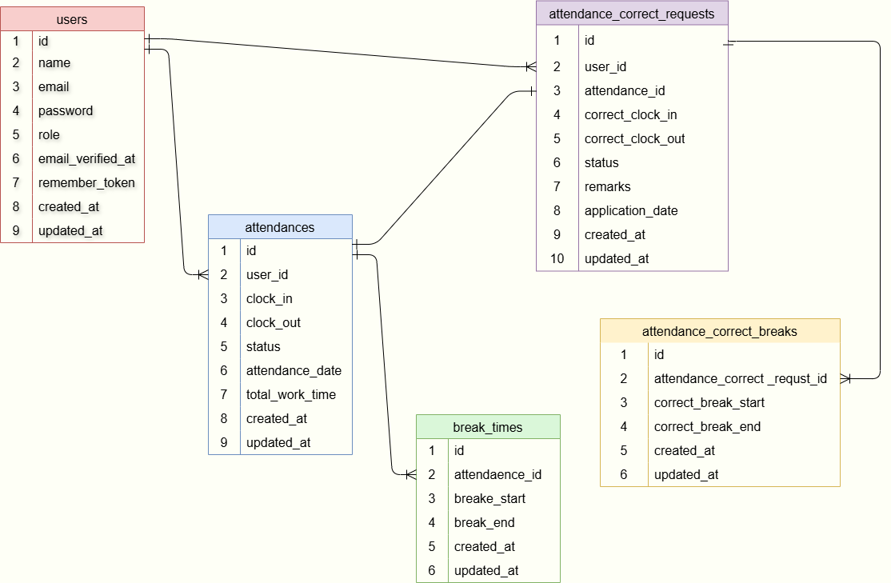

# FM-APP

# 開発環境セットアップ手順

このドキュメントでは、開発環境をセットアップするための手順を説明します。

## 1. 必要なツールのインストール
まず、以下のツールをインストールします。

- [GitHubのインストール](https://desktop.github.com/)（GitHub Desktop）
- [Dockerのインストール](https://docs.docker.com/get-docker/)
- [WSLのインストール](https://docs.microsoft.com/ja-jp/windows/wsl/install)

## 環境情報
- **OS**: Windows 11
- **WSL**: WSL2
- **Docker**: 28.1.1
- **Docker Compose**:  v2.36.0-desktop.1
- **PHP**: 7.4.9
- **Composer**: 2.8.9
- **MySQL**: 8.0.26
- **Laravel Framework**: 8.83.8

## 2. 開発用ディレクトリの作成
プロジェクトの作業ディレクトリを作成し、そこへ移動します。
```bash
mkdir kintaikanri-app
cd kintaikanri-app
```

セットアップの流れは、[laravel-setup.md](./docs/laravel-setup.md)を参照してください。


## 3. Dockerの設定
Docker環境をセットアップします。

1. `docker-compose.yml` を作成し、`nginx`, `php`, `mysql`, `phpMyAdmin` などのサービスを設定します。
2. `nginx` の設定ファイルを作成します。
3. `php` の設定ファイルを作成します。
4. `MySQL` の設定を行います。
5. `phpMyAdmin` の設定を行います。
6. `docker-compose up -d --build` を実行し、コンテナを起動します。

詳細な手順については、[docker-setup.md](./docs/docker-setup.md)を参照してください。

## 4. Laravelプロジェクトの作成
Docker環境が整ったら、コンテナ内でLaravelプロジェクトを作成します。
```bash
docker-compose exec php composer create-project --prefer-dist laravel/laravel .
```

詳細な手順については、[laravel-setup.md](./docs/laravel-setup.md)を参照してください。

## 5. GitHubでのリポジトリ作成
GitHubにリポジトリを作成し、ローカルリポジトリをセットアップします。
```bash
git init
git add .
git commit -m "Initial commit"
git branch -M main
git remote add origin <GitHubのリポジトリURL>
git push -u origin main
```
詳細な手順については、[git-setup.md](./docs/git-setup.md)を参照してください。

## 6. .gitignoreの設定
Laravelプロジェクトのための基本的な `.gitignore` 設定を行います。

詳細な手順については、[gitignore.example-setup.md](./docs/gitignore.example-setup.md)を参照してください。

## 7. .envの設定

詳細な手順については、[env.example-setup.md](./docs/env.example-setup.md)を参照してください。

## 8. マイグレーションの実行

**※** マイグレーションを実行する前に、`.env` ファイルのデータベース設定を確認してください。

データベースのテーブルを作成するために、以下のコマンドを実行してください。

```bash
php artisan migrate
```


データベースに初期データを投入するために、以下のコマンドを実行します

```bash
php artisan db:seed
```

## 9. Fortifyの設定

詳細な手順については、[fortify-setup.md](./docs/fortify-setup.md)を参照してください。

## 10. 開発環境の確認
セットアップが完了したら、Laravelのサーバーを起動し、正しく動作するか確認します。

ブラウザで `http://localhost` にアクセスし、Laravelの初期画面が表示されれば成功です。


## 11. Bootstrapの設定
Bootstrapを使ってレスポンシブデザインを効率化するためのセットアップ手順については、[bootstrap-setup.md](./docs/bootstrap-setup.md) を参照してください。

## 12. フロントエンド環境のセットアップ
npm（Node.js）でフロントエンドのパッケージをインストール

npmの依存関係をインストール
```bash
npm install
```

開発用のCSS・JavaScriptをビルド（コンパイル）
```bash
npm run dev
```

**※** 
npm run dev を実行しないと、CSSやJSが反映されない！
本番環境なら npm run prod で圧縮したファイルを作成

**※**
BladeやCSSを修正しても反映されない時の確認ポイント
反映されない原因チェック

1. CSS・JSのビルドを忘れていないか？

npm run dev を実行したか確認！

2. キャッシュが影響していないか？

ブラウザのキャッシュをクリア（Ctrl + Shift + R でリロード）

3. Laravelのキャッシュ削除を行ったか？

```bash
php artisan config:clear
php artisan cache:clear
php artisan view:clear
```

4. シンボリックリンクが正しく設定されているか？

ストレージにアップロードした画像が表示されない場合
```bash
php artisan storage:link
```
これらの確認ポイントをチェックして、問題が解決しない場合は再度確認を行ってください。


これで開発環境のセットアップは完了です。


